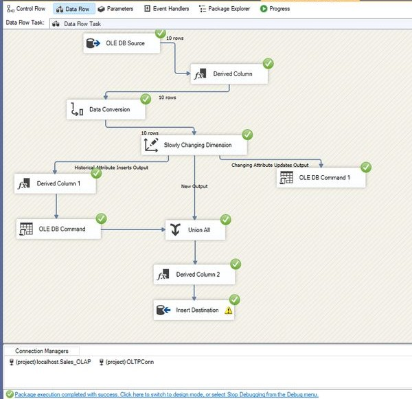

<p align="center">
  
  
  
</p>

<h1 align="center">
🏗️ SSIS Data Warehouse & ETL Pipeline
</h1>

<p align="center">
A complete Data Engineering project using SSIS, SQL Server, and Star Schema architecture.
</p>

---

# 📖 Overview

This project demonstrates the implementation of a complete **Data Warehouse & ETL Pipeline** using **SSIS** and **Microsoft SQL Server**.

The solution extracts data from multiple sources, transforms and cleans the data, then loads it into a structured Data Warehouse designed using the **Star Schema** model.

---

# ⚙️ Technologies Used

| Technology | Purpose |
|---|---|
| SQL Server | Data Warehouse Storage |
| SSIS | ETL Pipeline |
| T-SQL | Database Queries |
| Visual Studio | SSIS Development |

---

# 🏛️ Data Warehouse Architecture

## ⭐ Star Schema Design

The Data Warehouse follows a Star Schema architecture including:

### 📌 Fact Table
Stores measurable business metrics:
- Sales
- Quantity
- Revenue
- Counts

### 📌 Dimension Tables
Store descriptive business information:
- Customer Dimension
- Product Dimension
- Time Dimension
- Category Dimension

---

# 🔄 ETL Workflow

## 📥 Extract
Data extracted from:
- Excel Files
- SQL Databases

---

## 🔧 Transform
Data transformation operations include:
- Data Cleaning
- Handling NULL values
- Removing Duplicates
- Data Type Conversion
- Data Validation
- Standardization

---

## 📤 Load
Data loaded into:
- Fact Tables
- Dimension Tables

---

# 🚀 Project Features

✅ SSIS Control Flow Design  
✅ Data Flow Tasks  
✅ Error Handling  
✅ Data Validation  
✅ Star Schema Modeling  
✅ ETL Best Practices  
✅ Scalable Architecture

---

# 📂 Project Structure

```bash
SSIS-Sales-Project/
│
├── images/
│   ├── dataflow.png
│   ├── controlflow.png
│   └── schema.png
│
├── Lab2/
│   ├── SSIS Packages
│   ├── Data Sources
│   └── ETL Components
│
├── README.md
├── .gitignore
└── Lab2.sln
```

---

# 📸 Screenshots

## 🔹 SSIS Data Flow

<p align="center">
  
</p>

The ETL pipeline handles:
- Data extraction from source systems
- Data conversion and transformation
- Slowly Changing Dimension (SCD)
- Historical data handling
- Data loading into destination tables

---

## 🔹 Control Flow
_Add screenshot here_

---

## 🔹 Star Schema
_Add screenshot here_

---

# 🔮 Future Improvements

- Incremental Loading
- Package Scheduling
- Logging System
- Performance Optimization
- Cloud Integration
- Data Quality Monitoring

---

# 👨‍💻 Author

## Tharwat Farag

- Data Engineer
- ETL Developer
- SQL Server & SSIS Enthusiast

---

# ⭐ Support

If you like this project, feel free to ⭐ the repository.